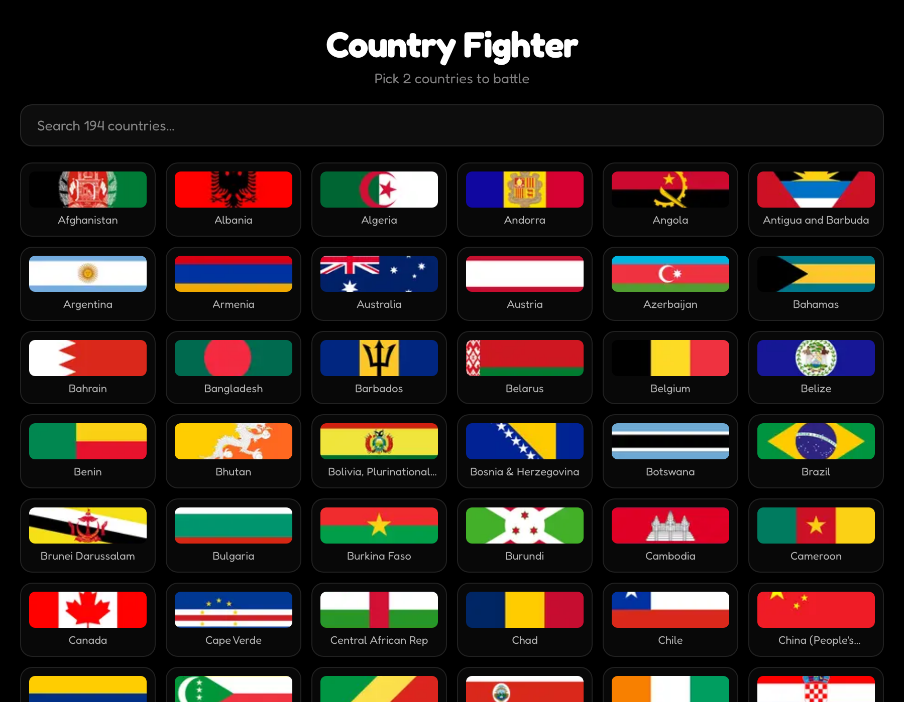
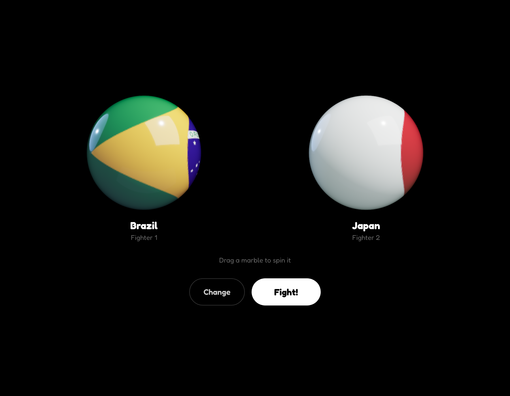
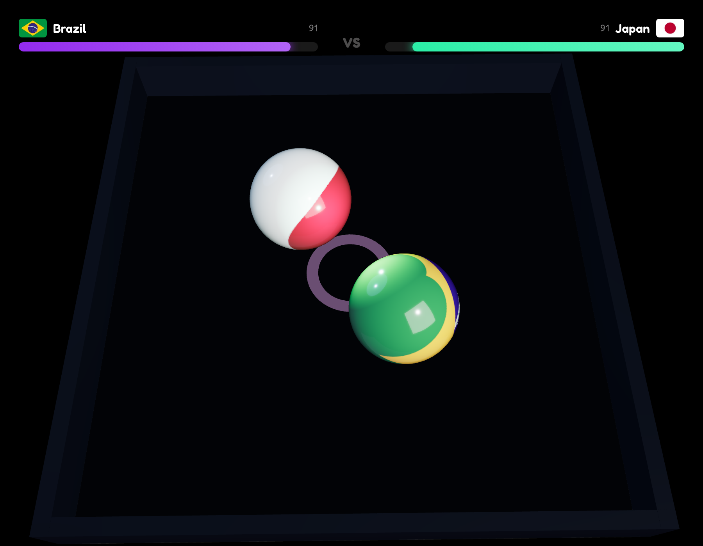
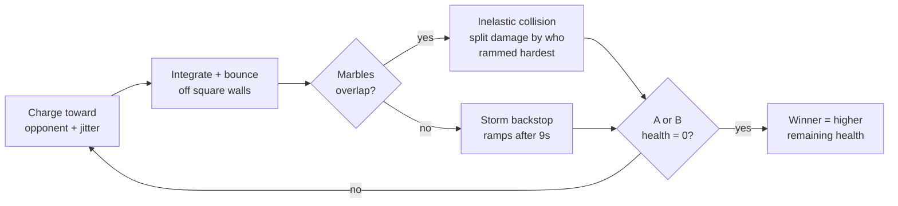

# Country Fighter

> Pick any 2 of the world's 194 countries and watch their glossy 3D flag-marbles battle it out in a bouncy arena. A tiny, playful game built for kids.

<p>
  
  
  
  
  
</p>

**Live:** https://country-fighter-bheng.vercel.app



---

## What it does

1. **Pick 2 countries** from all 194 recognized countries (193 UN members + Vatican City), with instant search.
2. **Meet the fighters** - each country becomes a polished, freely-rotatable 3D marble wrapped in its flag. Drag to spin.
3. **Fight!** - both marbles enter a solid-walled arena and charge, bounce, and slam into each other with playful physics.
4. **Crown a champion** - every collision chips a health bar; when one empties, the winner is announced with a confetti victory screen. Start a new battle in one tap.

| Rotatable flag marbles | Live arena battle |
| --- | --- |
|  |  |

---

## How the fight works

The whole simulation is a small, **pure, unit-tested physics core** (`lib/physics.ts`) driven by a fixed-timestep loop inside the R3F render frame.



Three ideas keep the battles fun **and** reliable:

- **Asymmetric damage** - you take more damage the harder the *other* marble drove into you, so a clear winner emerges with a visible health gap instead of a coin-flip tie.
- **Real-time storm backstop** - an escalating drain starts after 9 seconds so no match can drag on if the marbles get unlucky and keep missing. It runs on wall-clock time, so a fight always ends in bounded real time even on a slow GPU.
- **Fixed-timestep sim** - collisions are stable and framerate-independent; the match clock never stretches or shortens with the frame rate.

Every one of these lives behind a pure function with tests (`tests/physics.test.ts`).

---

## Tech stack

| Layer | Choice |
| --- | --- |
| Framework | Next.js 16 (App Router, static prerender) |
| UI runtime | React 19 |
| 3D | react-three-fiber 9 + drei 10 + three 0.185 |
| Language | TypeScript (strict) |
| Styling | Tailwind CSS 4 |
| Tests | node:test (unit) + Playwright (e2e) |
| Hosting | Vercel |

The 194 flags are **self-hosted PNGs** (`public/flags/`), so the game has no third-party CDN dependency and its Content-Security-Policy stays locked to `'self'`. Marble reflections are generated procedurally in-scene, so no HDR environment map is ever fetched.

---

## Getting started

```bash
git clone https://github.com/bunlongheng/country-fighter.git
cd country-fighter
npm install
npm run dev            # http://localhost:3010
```

No environment variables are required - it is a fully static, self-contained game.

### Scripts

| Command | What it does |
| --- | --- |
| `npm run dev` | Start the dev server on port 3010 |
| `npm run build` | Production build |
| `npm run typecheck` | `tsc --noEmit` |
| `npm run lint` | ESLint (typescript-eslint + next core-web-vitals) |
| `npm test` | Unit tests for the physics core + country data |
| `npm run test:e2e` | Playwright end-to-end smoke of the full game flow |

---

## Project structure

```
app/
  page.tsx              server shell
  components/
    Game.tsx            phase state machine: select -> ready -> fight -> victory
    CountryPicker.tsx   searchable 194-country grid
    MarblePreview.tsx   freely-rotatable single marble (R3F canvas)
    Marble.tsx          glossy flag sphere (shared)
    Arena.tsx           the battle: physics loop, walls, impact FX
    HealthBars.tsx      top HUD
    VictoryOverlay.tsx  winner + confetti
    Studio.tsx          lights + procedural reflections
  data/countries.ts     194 countries (code, name, accent hue)
lib/
  physics.ts            pure, tested simulation core
public/flags/           194 self-hosted flag PNGs
tests/                  unit tests (physics + data)
e2e/                    Playwright smoke test
```

---

## Testing

- **19 unit tests** cover the physics core (wall bounce, restitution, asymmetric damage split, storm backstop, speed clamps, winner logic) and the country data (exactly 194 unique codes, every country ships a flag).
- **4 Playwright e2e tests** cover the real user flow: load, search, pick two countries, run a full match to a winner, and restart.
- CI runs the full gate on every push and PR: `typecheck -> lint -> test -> build -> e2e`.

---

## Deploy

Pushing to `main` deploys to Vercel automatically. To deploy from the CLI:

```bash
vercel --prod
```

---

## License

[MIT](LICENSE) (c) Bunlong Heng
